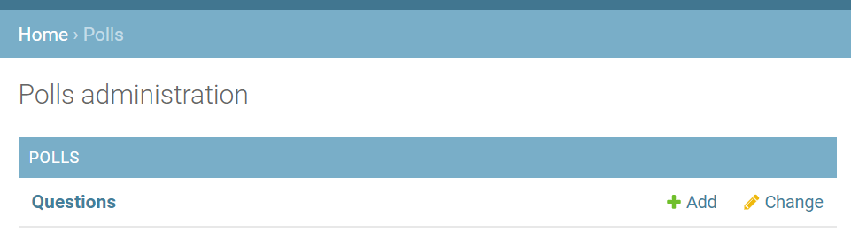

### Введение в Django
Выполнить все 7 частей туториала, опубликованного по ссылке: https://docs.djangoproject.com/en/3.2/ и предоставить ссылку на репозиторий с кодом и собственными комментариями по выполнению этих этапов работы.

### Урок 1
После трех часов попыток решить непредвиденные проблемы с установкой (на самом деле, проблемы с установкой и запуском начались еще месяц назад, но не будем о грустном) получилось все-таки создать проект! 


Теперь запускаем на сервере. Работает (я бы даже заплакала от счастья)


Далее происходит настоящая магия (ну или не совсем), но в любом случае polls на месте


После того, как мы написали код в двух файлах urls.py в папках mysite и polls, перехождим по адресу http://localhost:8000/polls/ и наслаждаемся любимым hello, world 


### Урок 2
Второй этап обучения. Редактируем файлы polls/models.py и mysite/settings.py.
 

Далее вызываем команду ```makemigrations``` сообщая Django, что мы внесли некоторые изменения в модели (в данном случае, создали новые) и что мы хотели бы сохранить эти изменения в виде миграции:


Команда ```sqlmigrate``` принимает имена миграций и возвращает их SQL:


Теперь снова запускаем ```migrate```, чтобы создать эти таблицы моделей в базе данных:


Изучаем Api. Заходим в Python Shell (или вернее создаем??) и немного поиграем с часовыми поясами:


Создадим usera и запустим сервер:


После того, как мы запустили сервер мы заходим под нашим логином и паролем на админсткую страницу Django:


После настраиваем файл polls/admin.py импортируя объекты модели Question:


На админской странице теперь отображается Question, и можно настраивать его объекты через браузер:


### Урок 3
Добавим еще несколько представлений в polls/views.py. Эти представления немного отличаются, потому что они принимают аргумент и после подключаем новые представления к модулю polls.urls, добавив вызовы path().
Теперь создаем каталог с названием templates в каталоге polls. Django будет искать шаблоны в этом каталоге. Мы могли бы обойтись размещением наших шаблонов непосредственно в polls/templates (а не создавать еще один подкаталог polls), но на самом деле это плохая идея. Django выберет первый попавшийся шаблон, название которого совпадает, и если у вас есть шаблон с таким же названием в другом приложении, Django не сможет отличить их друг от друга. Нам нужно иметь возможность указать Django на нужный шаблон, и лучший способ обеспечить это - разделить их по именам. То есть, поместить эти шаблоны в другой каталог, названный в честь самого приложения.
Еще раз меняем функцию index в polls/views.py, и запускаем наш сервер. Теперь мы видим укороченный список объектов:


Это очень распространенная  - загрузить шаблон, заполнить контекст и вернуть объект HttpResponse с результатом рендеринга шаблона. Django предлагает дейсововать более которким путем. Изменим код с этого:

```python
from django.http import HttpResponse
from django.template import loader

from .models import Question


def index(request):
    latest_question_list = Question.objects.order_by('-pub_date')[:5]
    template = loader.get_template('polls/index.html')
    context = {
        'latest_question_list': latest_question_list,
    }
    return HttpResponse(template.render(context, request))
```

На этот:

```python
from django.shortcuts import render

from .models import Question


def index(request):
    latest_question_lisОтвет заключается в добавлении пространств имен в URLconf. В файле polls/urls.py добавьте app_name, чтобы задать пространство имен приложения:t = Question.objects.order_by('-pub_date')[:5]
    context = {'latest_question_list': latest_question_list}
    return render(request, 'polls/index.html', context)
```

После этого во всех представлениях нам больше не нужно импортировать loader и HttpResponse. Функция render() принимает объект запроса в качестве первого аргумента, имя шаблона в качестве второго аргумента и словарь в качестве необязательного третьего аргумента. Она возвращает объект HttpResponse заданного шаблона, отображенный с заданным контекстом.

Теперь разберемся с представлением деталей вопроса - страницей, на которой отображается текст вопроса для данного опроса. Нам необходимо устранить зависимость от конкретных путей URL, определенных в конфигурациях url, используя тег шаблона  В файле polls/urls.py добавим app_name, чтобы задать пространство имен приложения и далее меняем шаблон polls/index.html, чтобы он указывал на детальное представление с разделенными именами.

### Урок 4
