### Введение в Django
Выполнить все 7 частей туториала, опубликованного по ссылке: https://docs.djangoproject.com/en/3.2/ и предоставить ссылку на репозиторий с кодом и собственными комментариями по выполнению этих этапов работы.

### Урок 1
После трех часов попыток решить непредвиденные проблемы с установкой (на самом деле, проблемы с установкой и запуском начались еще месяц назад, но не будем о грустном) получилось все-таки создать проект! 
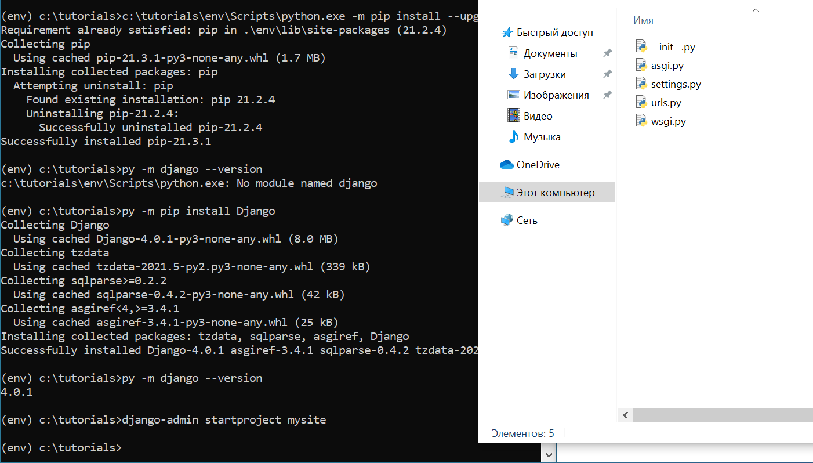

Теперь запускаем на сервере. Работает (я бы даже заплакала от счастья)
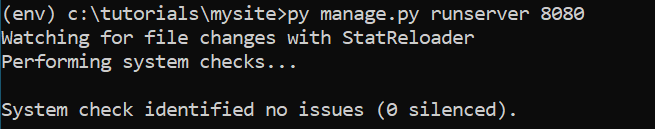

Далее происходит настоящая магия (ну или не совсем), но в любом случае polls на месте
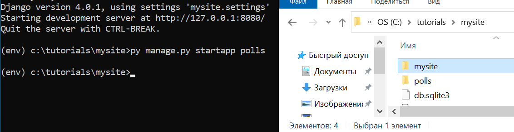

После того, как мы написали код в двух файлах urls.py в папках mysite и polls, перехождим по адресу http://localhost:8000/polls/ и наслаждаемся любимым hello, world 
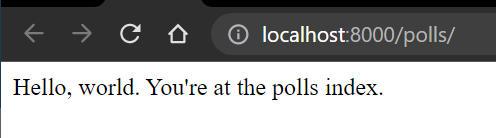

### Урок 2
Второй этап обучения. Редактируем файлы polls/models.py и mysite/settings.py.
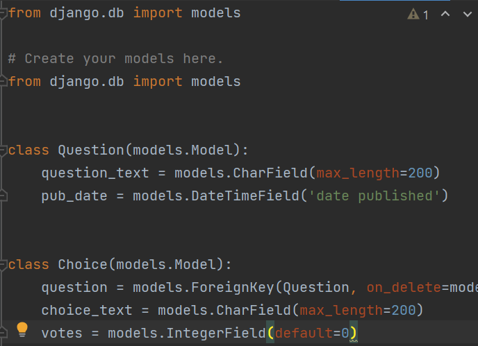 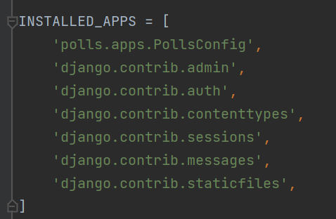

Далее вызываем команду ```makemigrations``` сообщая Django, что мы внесли некоторые изменения в модели (в данном случае, создали новые) и что мы хотели бы сохранить эти изменения в виде миграции:
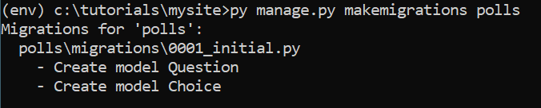

Команда ```sqlmigrate``` принимает имена миграций и возвращает их SQL:


Теперь снова запускаем ```migrate```, чтобы создать эти таблицы моделей в базе данных:
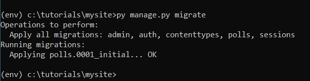

Изучаем Api. Заходим в Python Shell (или вернее создаем??) и немного поиграем с часовыми поясами:
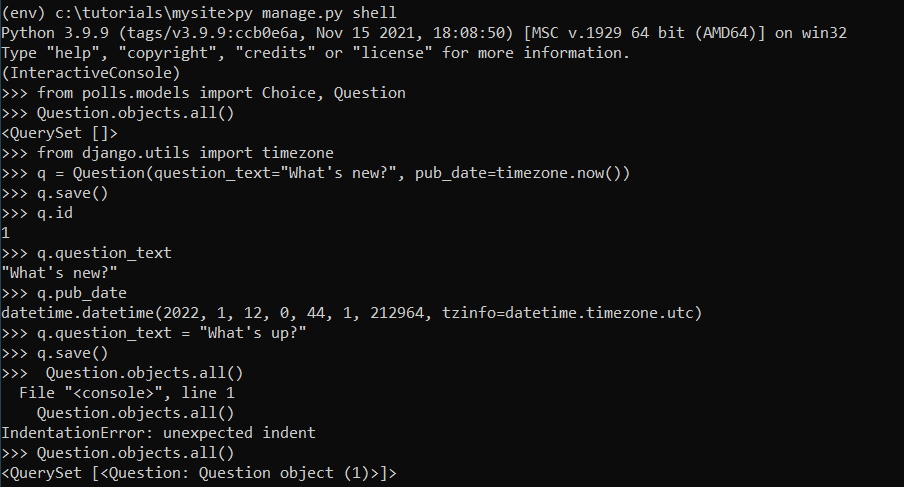

Создадим usera и запустим сервер:
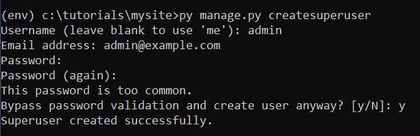

После того, как мы запустили сервер мы заходим под нашим логином и паролем на админсткую страницу Django:
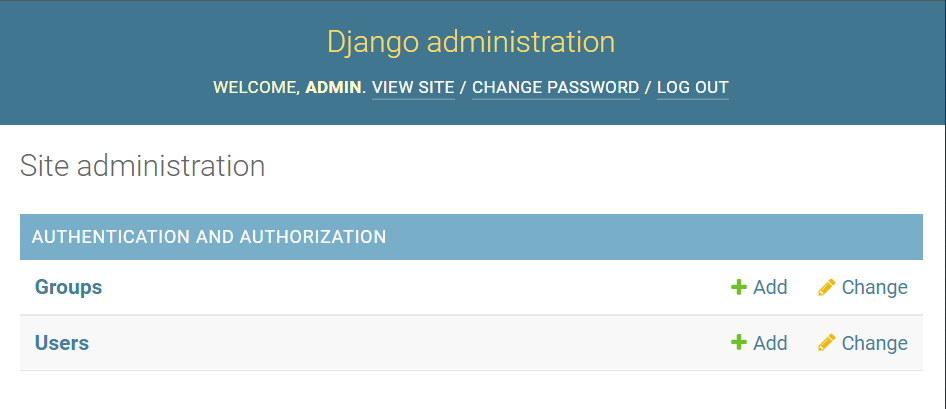

После настраиваем файл polls/admin.py импортируя объекты модели Question:
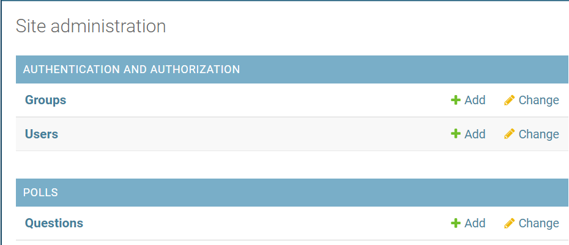

На админской странице теперь отображается Question, и можно настраивать его объекты через браузер:
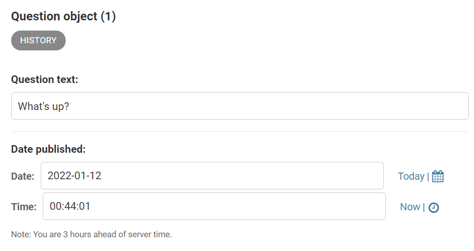
