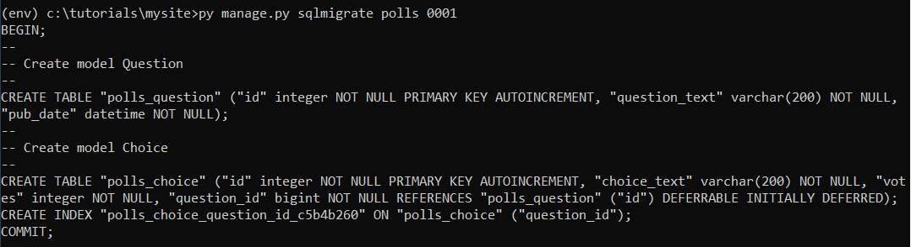
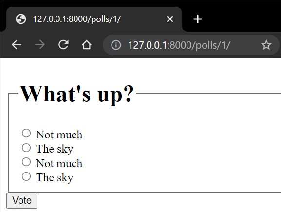
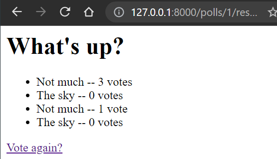
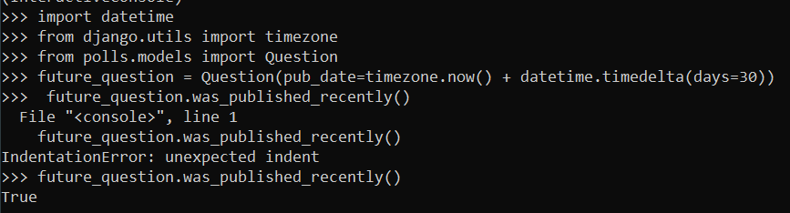
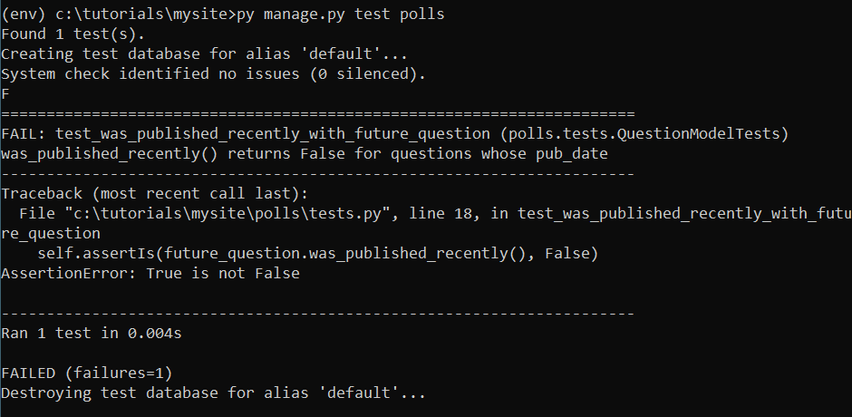
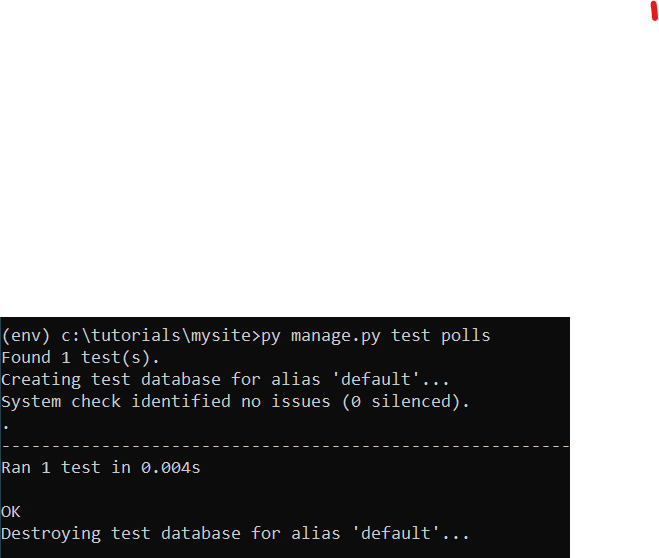
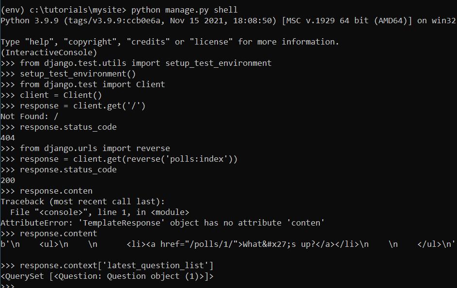
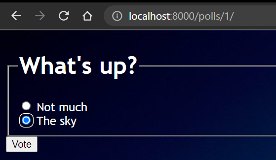

### Введение в Django
Выполнить все 7 частей туториала, опубликованного по ссылке: https://docs.djangoproject.com/en/3.2/ и предоставить ссылку на репозиторий с кодом и собственными комментариями по выполнению этих этапов работы.

### Урок 1
После трех часов попыток решить непредвиденные проблемы с установкой (на самом деле, проблемы с установкой и запуском начались еще месяц назад, но не будем о грустном) получилось все-таки создать проект! 


Теперь запускаем на сервере. Работает (я бы даже заплакала от счастья)


Далее происходит настоящая магия (ну или не совсем), но в любом случае polls на месте


После того, как мы написали код в двух файлах urls.py в папках mysite и polls, перехождим по адресу http://localhost:8000/polls/ и наслаждаемся любимым hello, world 


### Урок 2
Второй этап обучения. Редактируем файлы polls/models.py и mysite/settings.py.
 

Далее вызываем команду ```makemigrations``` сообщая Django, что мы внесли некоторые изменения в модели (в данном случае, создали новые) и что мы хотели бы сохранить эти изменения в виде миграции:


Команда ```sqlmigrate``` принимает имена миграций и возвращает их SQL:


Теперь снова запускаем ```migrate```, чтобы создать эти таблицы моделей в базе данных:


Изучаем Api. Заходим в Python Shell (или вернее создаем??) и немного поиграем с часовыми поясами:


Создадим usera и запустим сервер:


После того, как мы запустили сервер мы заходим под нашим логином и паролем на админсткую страницу Django:


После настраиваем файл polls/admin.py импортируя объекты модели Question:


На админской странице теперь отображается Question, и можно настраивать его объекты через браузер:


### Урок 3
Добавим еще несколько представлений в polls/views.py. Эти представления немного отличаются, потому что они принимают аргумент и после подключаем новые представления к модулю polls.urls, добавив вызовы path().
Теперь создаем каталог с названием templates в каталоге polls. Django будет искать шаблоны в этом каталоге. Мы могли бы обойтись размещением наших шаблонов непосредственно в polls/templates (а не создавать еще один подкаталог polls), но на самом деле это плохая идея. Django выберет первый попавшийся шаблон, название которого совпадает, и если у вас есть шаблон с таким же названием в другом приложении, Django не сможет отличить их друг от друга. Нам нужно иметь возможность указать Django на нужный шаблон, и лучший способ обеспечить это - разделить их по именам. То есть, поместить эти шаблоны в другой каталог, названный в честь самого приложения.
Еще раз меняем функцию index в polls/views.py, и запускаем наш сервер. Теперь мы видим укороченный список объектов:


Это очень распространенная  - загрузить шаблон, заполнить контекст и вернуть объект HttpResponse с результатом рендеринга шаблона. Django предлагает дейсововать более которким путем. Изменим код с этого:

```python
from django.http import HttpResponse
from django.template import loader

from .models import Question


def index(request):
    latest_question_list = Question.objects.order_by('-pub_date')[:5]
    template = loader.get_template('polls/index.html')
    context = {
        'latest_question_list': latest_question_list,
    }
    return HttpResponse(template.render(context, request))
```

На этот:

```python
from django.shortcuts import render

from .models import Question


def index(request):
    latest_question_lisОтвет заключается в добавлении пространств имен в URLconf. В файле polls/urls.py добавьте app_name, чтобы задать пространство имен приложения:t = Question.objects.order_by('-pub_date')[:5]
    context = {'latest_question_list': latest_question_list}
    return render(request, 'polls/index.html', context)
```

После этого во всех представлениях нам больше не нужно импортировать loader и HttpResponse. Функция render() принимает объект запроса в качестве первого аргумента, имя шаблона в качестве второго аргумента и словарь в качестве необязательного третьего аргумента. Она возвращает объект HttpResponse заданного шаблона, отображенный с заданным контекстом.

Теперь разберемся с представлением деталей вопроса - страницей, на которой отображается текст вопроса для данного опроса. Нам необходимо устранить зависимость от конкретных путей URL, определенных в конфигурациях url, используя тег шаблона  В файле polls/urls.py добавим app_name, чтобы задать пространство имен приложения и далее меняем шаблон polls/index.html, чтобы он указывал на детальное представление с разделенными именами.

### Урок 4
Обновим шаблон детализации опроса polls/detail.html и обновим URLconf для приложения polls.Мы также создали фиктивную реализацию функции vote(). Теперь создадим настоящую версию добававив код в polls/views.py. Теперь создадим шаблон polls/results.html и запустим сервер. Теперь перейдем по адресу /polls/1/ в своем браузере и проголосуем за вопрос. Отправим результат и увидим страницу результатов, которая обновляется каждый раз, когда мы голосуем. Если отправить форму, не выбрав вариант, мы увидим сообщение об ошибке.



Давайте переделаем наше приложение для опросов на использование общей системы представлений, чтобы удалить кучу собственного кода. Для преобразования нам потребуется выполнить несколько шагов. Мы сделаем следующее:

* Преобразуем URLconf.
* Удалим некоторые старые, ненужные представления.
* Введем новые представления, основанные на общих представлениях Django.

Запустим сервер и используем новое приложение для опроса, основанное на общих представлениях. В итоге отображение на сайте не изменилось, однако кода стало гораздо меньше, и он стал более понятным.

### Урок 5
В данном уроке мы займемся тестами. Читаем инструкцию и приступаем.

С помощью этого вопроса я смогла выявить ошибку кода, которую нужно исправить и я была бы не я, если бы не ошиблась в последней же строчке...

Теперь пишем тест для этой ошибки, чтобы убедиться в том, что ошибка действительно есть, а потом меняем код, чтобы исправить данную и будущие ошибки.

Здесь мы создали подкласс django.test.TestCase с методом, который создает экземпляр Question с датой публикации в будущем. Затем мы проверяем результат функции was_published_recently() - он должен быть False. После чего запускаем наши тесты и выявляем ошибку.


После того, как ошибка обнаружена - исправляем ее и снова запускаем тесты.Ура! Все работает.


Добавьте еще два тестовых метода к тому же классу, чтобы более полно протестировать поведение метода. И теперь у нас есть три теста, которые подтверждают, что Question.was_published_recently() возвращает разумные значения для прошлых, недавних и будущих вопросов.

Для того чтобы проверить клиентскую часть напишем команды в интерактивную среду:


Запуст показал, что список опросов показывает опросы, которые еще не опубликованы, поэтому далее необходимо исправить views.py. Question.objects.filter(pub_date__lte=timezone.now()) возвращает набор запросов, содержащий вопросы, чья дата публикации меньше или равна - то есть раньше или равна - timezone.now.

Следующим шагом стало добавление тестов, которые будут проверять правильность отображения главной страницы приложения, страницы опроса и страницы результатов. Поэтому в файле tests.py появился большой пласт дополнительных тестов.

### Урок 6

Переходим к созданию своего первого приложения на джанго. Создаем директорию polls/static/polls/ и добавляем туда файл style.css. После написания нескольких строк кода получяается вот такое оформление: 


### Урок 7
