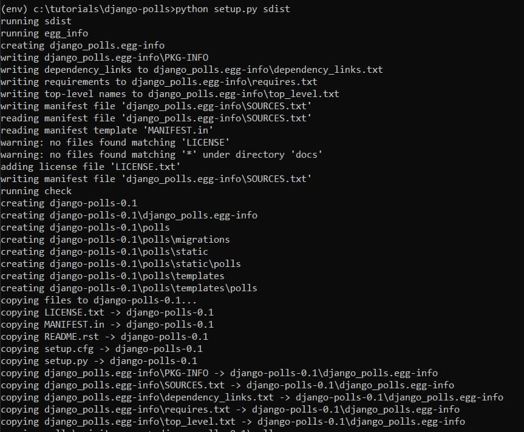

### Создание дистрибутива приложения Django. Контейнеризация Django

1. Прочитайте и выполните инструкции по созданию переиспользуемых приложений на джанго. 

В качестве ответа приложите файл с "упакованным" приложением. Как альтернатива — выгрузите файл его в облачное хранилище или в раздел Releases в Гитхаб того репозитория, где было размещено приложение.

2. На основе предложенных ниже статей и собственного изучения других материалов создайте контейнеризованный вариант написанного приложения на Django. 

Статьи для изучения: 

https://docs.docker.com/samples/django/
https://pythonru.com/uroki/docker-django
https://dev-gang.ru/article/naczalo-raboty-s-docker-i-django-73cvl13n55/
Разместите файлы, необходимые для создания этого решения также в гитхабе вашего проекта.

### Ход выполнения лабораторной работы

Данная лабораторная работа является логическим продолжение лабораторной работы 7, с которой можно ознакомиться выше в данном репозитории... 

...но изначально я этого не заметила, поэтому сейчас вновь запускаю виртуальное окружение и молюсь, чтобы все работало стабильно (спасибо, Windows)

Во-первых, создаем родительский каталог для polls вне проекта Django. И называем этот каталог django-polls. Перемещаем каталог polls в каталог django-polls и создаем файл django-polls/README.rst. Дальше создаем файл django-polls/LICENSE отвечающий за лицензию. Остается создать файлы setup.cfg и setup.py, в которых подробно описано, как собрать и установить приложение. По умолчанию в пакет включаются только модули и пакеты Python. Чтобы включить дополнительные файлы, нам нужно создать файл MANIFEST.in.

Теперь попробуем собрать пакет с помощью python setup.py sdist (запуск изнутри django-polls). Это создаст каталог dist и соберет новый пакет, django-polls-0.1.tar.gz.

Все!
